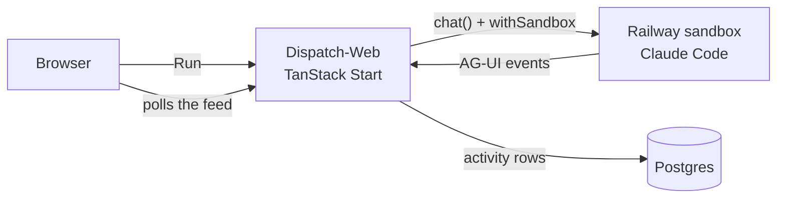

# Dispatch: TanStack Start + AI sandboxes on Railway

[](https://railway.com/new/template/LnGwdz?utm_medium=integration&utm_source=button&utm_campaign=tanstack-start-sandbox)

A work tracker built with [TanStack Start](https://tanstack.com/start) and [TanStack AI](https://tanstack.com/ai), deployed on [Railway](https://railway.com). Every task has a **Run** button. Press it and a Railway sandbox boots, [Claude Code](https://docs.claude.com/en/docs/claude-code) works the task inside it, and each step lands in the task's activity feed.

The sandbox work goes through TanStack AI's sandbox primitives: `defineSandbox` and `defineWorkspace` describe the sandbox, the [`@tanstack/ai-sandbox-railway`](https://www.npmjs.com/package/@tanstack/ai-sandbox-railway) provider creates it on Railway, `withSandbox` attaches it to a `chat()` call, and the [`@tanstack/ai-claude-code`](https://www.npmjs.com/package/@tanstack/ai-claude-code) harness runs Claude Code inside it.

## Contents

- [Quick start](#quick-start)
- [How a run works](#how-a-run-works)
- [Deploying on Railway](#deploying-on-railway)
- [Access and the API](#access-and-the-api)
- [Developing locally](#developing-locally)
- [Project structure](#project-structure)
- [Making it your own](#making-it-your-own)

## Quick start

**Deploy:** click **Deploy on Railway** above and enter an `ANTHROPIC_API_KEY` from the [Anthropic Console](https://console.anthropic.com). Railway provisions the app and Postgres, generates the access password, runs the migrations, and gives you a URL.

**Give it a project token.** Dispatch creates sandboxes with a Railway project token, which can only reach this project's environment:

1. In the new project, open **Settings → Tokens** and create a token for the `production` environment.
2. Add it to the `Dispatch-Web` service as a variable named `RAILWAY_TOKEN`, and deploy the change.

The app's Settings page links to the tokens page and shows what's still missing.

Then sign in with the `DISPATCH_PASSWORD` variable Railway generated, open a task, and press **Run in Agent Sandbox**.

**Run locally** (Node 24+, pnpm, Docker):

```bash
pnpm install
cp .env.example .env   # add ANTHROPIC_API_KEY, RAILWAY_TOKEN, RAILWAY_ENVIRONMENT_ID
pnpm db:up             # Postgres in Docker
pnpm db:migrate        # create tables and seed the Default project
pnpm dev               # http://localhost:3000
```

## How a run works



1. **The sandbox is defined, not created.** [`src/server/sandbox.server.ts`](src/server/sandbox.server.ts) builds a `defineSandbox` for each run:
   - the provider is `railwaySandbox()`;
   - the workspace's `setup` makes sure the `claude` CLI is present;
   - `ANTHROPIC_API_KEY` comes from `createSecrets`, so it's injected into the sandbox and never stored;
   - the lifecycle is `reuse: 'none'` with `destroyOnComplete: true`, so each run gets a fresh sandbox that's gone when the run ends.
2. **`chat()` drives the run.** [`src/server/runs.server.ts`](src/server/runs.server.ts) calls `chat({ adapter: claudeCodeText(model), outputSchema: RunReport, middleware: [withSandbox(sandbox), feed.middleware] })`. `withSandbox` creates the sandbox (in a few seconds on Railway) and hands it to the Claude Code harness, which runs `claude` inside it. Because of `outputSchema`, the agent finishes with a typed `{ summary, outputs }` report instead of prose to parse.
3. **A middleware records the activity feed.** [`src/server/activity-feed.server.ts`](src/server/activity-feed.server.ts) is a `defineChatMiddleware`: `onChunk` writes messages and tool calls (with their output) to Postgres as they happen, and its `sandbox.onFileCreate` / `onFileChange` hooks collect the files the agent changed. The task page polls the feed while a run is active.
4. **Runs end cleanly.** A finished run moves the task to In Review with the agent's summary. Cancelling (with TanStack AI's `RUN_CANCEL_REASON`) or failing puts it back in To do. Every run has a 15-minute limit. On a redeploy, the old server cancels its runs as it shuts down. If a server dies mid-run, the run's heartbeat goes stale; it's marked failed and its sandbox is destroyed.

The task is the `chat()` thread and each run is one execution of it. Runs are driven on the server, not streamed to a browser tab, so closing the tab doesn't stop the agent. TanStack AI also supports [durable runs](https://github.com/TanStack/ai/blob/main/docs/sandbox/durable-runs.md) that survive a server restart by journaling inside the sandbox; Dispatch keeps runs short and simple instead.

The sandboxes are created in the app's own Railway environment, using `RAILWAY_ENVIRONMENT_ID`, which Railway sets on every deployment.

## Deploying on Railway

The template provisions two services:

| Service | Configuration |
| --- | --- |
| **Dispatch-Web** (this repo) | Build: Railpack (`pnpm build`)<br>Start: `node .output/server/index.mjs`<br>Pre-deploy: `node scripts/migrate.mjs`<br>Health check: `/api/health`<br>A generated public domain |
| **Postgres** | Railway Postgres |

### Environment variables

| Variable | Set by | Purpose |
| --- | --- | --- |
| `DATABASE_URL` | Template: `${{Postgres.DATABASE_URL}}` | Postgres over the private network |
| `DISPATCH_PASSWORD` | Template: `${{secret(24)}}` | Access password for the app and the API |
| `SESSION_SECRET` | Template: `${{secret(32)}}` | Encrypts the session cookie |
| `ANTHROPIC_API_KEY` | You, on the deploy form | Claude Code runs on it inside each sandbox |
| `RAILWAY_TOKEN` | You, after deploy | A project token for this environment. Creates the sandboxes. (`RAILWAY_API_TOKEN`, an account or workspace token, also works but can reach everything you own.) |
| `RAILWAY_ENVIRONMENT_ID` | Railway | Where sandboxes are created |
| `DISPATCH_MODEL` | Optional | The model Claude Code uses (default `sonnet`) |

### What happens on each deploy

1. **Build.** Railpack installs dependencies with pnpm and runs `pnpm build`. Nitro writes a self-contained server to `.output/`.
2. **Pre-deploy.** [`scripts/migrate.mjs`](scripts/migrate.mjs) waits for Postgres, applies the Drizzle migrations in `drizzle/`, and seeds the Default project on a fresh database. If it fails, the deploy stops and the previous version keeps serving.
3. **Health check.** The new deployment receives traffic only after `/api/health` can reach the database.

[`.railway/railway.ts`](.railway/railway.ts) describes the same setup as [infrastructure as code](https://docs.railway.com/infrastructure-as-code); apply it with `railway config plan` and `railway config apply`.

## Access and the API

Everything except the landing page, `/login` and `/api/health` needs the access password:

- **In the browser**, `/login` exchanges it for an encrypted session cookie. Signed-in pages and server functions check it.
- **For the REST API**, send it as a bearer token. The API doesn't accept the session cookie, so a cross-site form can't write with a signed-in visitor's cookie.

```bash
export AUTH="authorization: Bearer $DISPATCH_PASSWORD"
curl -s -H "$AUTH" $APP_URL/api/v1/projects
curl -s -X POST -H "$AUTH" -H 'content-type: application/json' \
  $APP_URL/api/v1/projects/<projectId>/tasks -d '{"title": "Fetch the top HN stories"}'
curl -s -X POST -H "$AUTH" $APP_URL/api/v1/tasks/<taskId>/run     # 202 { runId }
curl -s -H "$AUTH" $APP_URL/api/v1/tasks/<taskId>                  # task, feed, active run
curl -s -X DELETE -H "$AUTH" $APP_URL/api/v1/tasks/<taskId>/run   # cancel
```

The UI and the API share one set of operations ([`src/server/ops.server.ts`](src/server/ops.server.ts)). Webhooks (Settings → Webhooks) POST task and run events to your URLs.

Without `DISPATCH_PASSWORD`, the app refuses access in production and runs open in local development. In production it also refuses to start sessions without a `SESSION_SECRET` of 32+ characters.

## Developing locally

| Script | What it does |
| --- | --- |
| `pnpm dev` | Vite dev server on http://localhost:3000 |
| `pnpm build` | Production build to `.output/` |
| `pnpm start` | Run the production build |
| `pnpm typecheck` | TypeScript checks |
| `pnpm db:up` | Start Postgres in Docker |
| `pnpm db:generate` | Generate a migration after editing [`src/server/schema.ts`](src/server/schema.ts) |
| `pnpm db:migrate` | Apply migrations and seed an empty database |

Runs need `RAILWAY_TOKEN` and `RAILWAY_ENVIRONMENT_ID` locally. Use the project token you created and the environment it belongs to (`railway variables` shows the id), and the sandboxes are created there.

## Project structure

```
.
├── .railway/railway.ts          Railway infrastructure as code
├── drizzle/                     generated SQL migrations (committed)
├── scripts/migrate.mjs          pre-deploy: wait for Postgres, migrate, seed
└── src/
    ├── start.ts                 CSRF + REST API auth middleware
    ├── router.tsx               router + per-request QueryClient
    ├── routes/                  pages (/app/*), /login, /api/v1/*, /api/health
    ├── server/
    │   ├── sandbox.server.ts    defineSandbox: Railway provider, workspace, lifecycle
    │   ├── runs.server.ts       chat() + withSandbox + Claude Code, the typed run report
    │   ├── activity-feed.server.ts  chat middleware that records the activity feed
    │   ├── tracker.functions.ts server functions for the UI
    │   ├── auth.functions.ts    sign-in server functions
    │   ├── middleware.ts        requireAuth function middleware
    │   ├── ops.server.ts        tracker operations shared by the UI and the API
    │   ├── auth.server.ts       password check and session cookie
    │   ├── db.server.ts         Postgres client (server-only)
    │   └── schema.ts            Drizzle schema
    ├── lib/
    │   ├── queries.ts           query options shared by loaders and components
    │   └── seed-tasks.json      the Default project's starter tasks
    └── components/
```

## Making it your own

- **Give the agent a repo.** Swap `source: { type: 'none' }` in `sandbox.server.ts` for `githubRepo({ repo: 'owner/name' })` and Claude Code starts in a clone of it.
- **Use another harness.** TanStack AI has Codex, OpenCode and other harness adapters. Change `claudeCodeText(...)` in `runs.server.ts` and the matching secret in `sandbox.server.ts`.
- **Limit what the agent can do.** Add a `defineSandboxPolicy` to the sandbox definition to deny commands.
- **Reach your other services.** Pass `networkIsolation: 'PRIVATE'` to `railwaySandbox()` and the sandbox joins the environment's private network.
- **Preview environments.** A project token only works in the environment it was created for, so a PR environment needs its own `RAILWAY_TOKEN` before its runs work.
- **Scaling out.** Runs are driven by the server that started them, and cancel only reaches runs on the same replica. Keep the `Dispatch-Web` service at one replica, or move run control to a queue.
